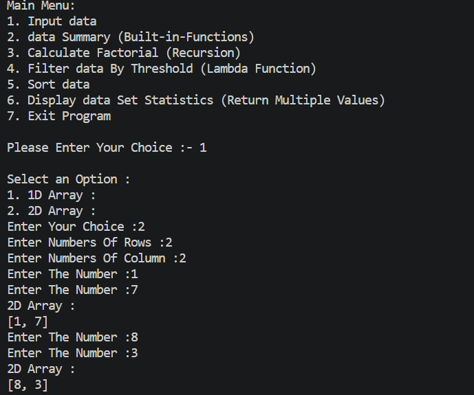

# Data Analyzer and Transformer Program

## 📌 Project Overview

**Data Analyzer and Transformer Program** is a Python-based menu-driven program that allows the user to enter, analyze, filter, sort, and perform calculations on data.

The program supports:

- 1D Array
- 2D Array
- Data Summary
- Factorial Calculation
- Threshold Filtering
- Data Sorting
- Dataset Statistics

This project demonstrates important Python programming concepts such as functions, lists, loops, recursion, lambda functions, filter functions, built-in functions, and returning multiple values.

## 🚀 Features

1. **Input Data**
   - Accepts 1D Array
   - Accepts 2D Array

2. **Data Summary**
   - Total number of elements
   - Minimum value
   - Maximum value
   - Sum
   - Average

3. **Calculate Factorial**
   - Uses recursion to calculate factorial.

4. **Filter Data by Threshold**
   - Uses Lambda Function.
   - Uses `filter()`.

5. **Sort Data**
   - Ascending order
   - Descending order

6. **Display Dataset Statistics**
   - Returns minimum, maximum, total, and average values.

7. **Exit Program**
   - Exits the program using `break`.

## 🛠️ Technologies Used

- Python 3
- Python Lists
- Functions
- Loops
- Conditional Statements
- Recursion
- Lambda Functions
- Filter Function
- Built-in Functions
## File Stucture
|
|_main.py
|_output.png
|_README.md

## ▶️ How to Run

### Step 1: Install Python

Make sure Python 3 is installed on your computer.

Check Python version:

python --version
# Data Analyzer and Transformer Program

## 📌 Project Overview

**Data Analyzer and Transformer Program** is a Python-based menu-driven program that allows the user to enter, analyze, filter, sort, and perform calculations on data.

The program supports:

- 1D Array
- 2D Array
- Data Summary
- Factorial Calculation
- Threshold Filtering
- Data Sorting
- Dataset Statistics

This project demonstrates important Python programming concepts such as functions, lists, loops, recursion, lambda functions, filter functions, built-in functions, and returning multiple values.

## 🚀 Features

1. **Input Data**
   - Accepts 1D Array
   - Accepts 2D Array

2. **Data Summary**
   - Total number of elements
   - Minimum value
   - Maximum value
   - Sum
   - Average

3. **Calculate Factorial**
   - Uses recursion to calculate factorial.

4. **Filter Data by Threshold**
   - Uses Lambda Function.
   - Uses `filter()`.

5. **Sort Data**
   - Ascending order
   - Descending order

6. **Display Dataset Statistics**
   - Returns minimum, maximum, total, and average values.

7. **Exit Program**
   - Exits the program using `break`.

#3 Ouput Imaage

## 🛠️ Technologies Used

- Python 3
- Python Lists
- Functions
- Loops
- Conditional Statements
- Recursion
- Lambda Functions
- Filter Function
- Built-in Functions

